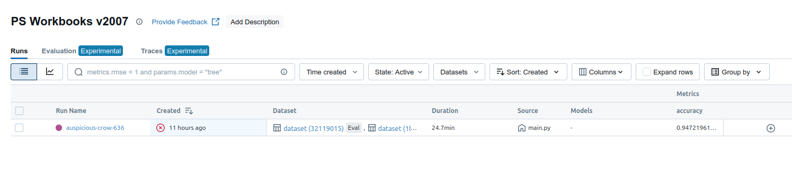

# Purse Seine Workbook Scan Classifier

## Background

This repository contains code for fine-tuning a TensorFlow image classification model
on purse seine observer workbook scans.  The fine-tuning is accomplished via [MediaPipe Model Maker](https://ai.google.dev/edge/mediapipe/solutions/model_maker).
The data for fine tuning came from about 60 scanned workbooks.  MediaPipe Model Maker was used as it is the easiest way to create a TFLite fine tune.  The overall goal is to use an NPU to run classification at the edge.

This code also demonstrates using MLFlow to track fine-tuning in MediaPipe Model Maker.


## Challenges

The scan dataset is imbalanced.  Observers fill out some forms daily, others are once per trip, and still others are optional and may not be present.
A naive fine-tune was first attempted.  This performed well on highly represented page types (PS-2 and PS-4) but did poorly on uncommon pages.  This code
represents a second attempt using sklearn to determine class weights.

## Outcome

Accuracy for uncommon forms has improved.  In the first iteration, results for uncommon forms were completely inaccurate.  With this version, labels are correct although confidence is still low.  Interested parties can use the [fine-tuned model](./efficientnet_lite4_psworkbook_weighted.tflite) with [MediaPipe Studio](https://mediapipe-studio.webapps.google.com/studio/demo/image_classifier) to check accuracy for themselves.

## Setup

There are some minor logistical challenges with `MediaPipe Model Maker`.  The largest is that the library isn't compatible with Python 3.12.  To run this training job, use Python 3.11.  The primary dependencies for this project are:

```
# Don't use latest versions due to NumPy 2.0 transition
tensorflow-text==2.16.1
mediapipe-model-maker
# Upgrade tensorflow to include associated CUDA capabilities
'tensorflow[and-cuda]'
mlflow
```

See [pip freeze output](./requirements-freeze.txt) for more details.
